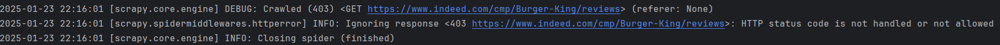

# Scrapy & Kameleo Integration for web scraping

These examples help to showcase how to gather data efficiently from websites with advanced anti-bot protection like [Cloudflare](https://cloudflare.com/) Turnstile.

A more detailed description about this project is available on [our website](https://kameleo.io/blog/how-to-bypass-cloudflare-turnstile-with-scrapy).

## 1-a-showcase-the-speed-of-scrapy

- I use [Scrapy](https://pypi.org/project/Scrapy/) to gather data from the [quotes.toscrape.com](https://quotes.toscrape.com/) website.
- The spider goes over the 10 pages of data in **2.6 seconds** ensuring a really effective technique.

## 1-b-scrapy-cloudflare
- I showcase that Scrapy is receiving `HTTPS 403 error message` when I try to scrape data from a website that is protected by an anti-bot system.

## 2-a-compare-speed-with-headless-browser

- In the second example I use [Playwright](https://playwright.dev/) to scrape the same dataset form the [quotes.toscrape.com](https://quotes.toscrape.com/) website.
- The headless browser needs to render the page that makes the scraping slower. It takes about **6.4 seconds** to gather the data.

## 2-b-playwright-cloudflare
- I showcase that playwright is receiving "infinite captcha" when I try to scrape data from a website that is protected by an anti-bot system.

---
Headless browsers come handy when you scrape data from JavaScript heavy websites, or you want to interact more with the website. When data is protected by anti-bot systems, the best you can do is to utilize an anti-detect browser. [Kameleo](https://kameleo.io/web-scraping?utm_medium=readme&utm_campaign=scrapy_kameleo) provides an undetectable web automation browser. This is not an open-source solution, however the platform provides unlimited fresh fingerprints, and ensures that their custom-built browsers (Chroma and Junglefox) are constantly updated to ensure, you stay on top of the anti-bot game without tiring maintenance overhead.

In the second part of the demo we try to scrape data from the [review page of BurgerKing on indeed.com](https://www.indeed.com/cmp/Burger-King/reviews).

If you try to open the page, you will see the [Cloudflare Turnstile](https://www.cloudflare.com/application-services/products/turnstile/)

Most headless Chrome browsers fail to bypass this protection layer.
> According to Pierluigi Vinciguerra from [The Web Scraping Club](https://substack.thewebscraping.club/p/how-to-bypass-cloudflare-turnstile?utm_source=kameleo_github&utm_campaign=scrapy_kameleo) it is very hard to rely on open source solutions such as Playwright and [Cloudscraper](https://pypi.org/project/cloudscraper/). I couldn’t make it work with almost any open-source tools like [Puppeteer Stealth](https://github.com/berstend/puppeteer-extra/tree/master/packages/puppeteer-extra-plugin-stealth) or [Playwright Stealth](https://pypi.org/project/playwright-stealth/). When I found a working solution like [Botasaurus](https://github.com/omkarcloud/botasaurus), later when I tried to deploy my code it wasn’t working anymore, and Cloudflare blocked my scraper bot.

[Kameleo](https://kameleo.io/web-scraping?utm_medium=github_readme&utm_campaign=scrapy_kameleo_integration) is an anti-detect browser specialized for web scraping. We are constantly testing our custom-built browsers (Chroma and Junglefox) against anti-bot systems. Updates are quickly deployed to ensure you don't need to maintain your code to keep a high success rate.

---

## 3-bypass-cloudflare-turnstile-with-Kameleo

- Kameleo launches its undetected chrome (called Chroma) with a fresh browser fingerprint.
- It simply bypasses the Cloudflare Turnstile and loads the BurgerKing review page on indeed.com
- We export the `cf_clearance` cookie which is our "pass through ticket for future cloudflare verifications"

## 4-add-cf_clearance-cookie-to-scrapy

- Scrapy wouldn't be able to scrape the data from the BurgerKing review page due to an `403 forbidden` error message caused by the protection by Cloudflare.

- So I add the `cf_clearance` cookie to the request.
- Note that I also need to set up the same `user-agent` for Scrapy that I used with Kameleo when I was getting the `cf_clearance` cookie.
- This ensures I can do effective scraping behind Cloudflare's protection layer 